# 📝 Todo App

> A beautiful, modern todo application built with Flutter featuring seamless task management, multi-language support, and stunning UI/UX design.

[](https://flutter.dev)
[](https://dart.dev)
[](LICENSE)
[](https://flutter.dev)

---

## ✨ Features

- ✅ **Smart Task Management** - Create, update, delete, and organize tasks effortlessly
- 🌍 **Multi-Language Support** - English & Arabic with seamless localization
- 🎨 **Dark & Light Themes** - Beautiful UI with automatic theme switching
- 👤 **User Profile** - Manage your profile and preferences
- 🔔 **Smart Notifications** - Toast & snackbar alerts for task actions
- 📱 **Cross-Platform** - Native support for iOS, Android, and Web
- 🎯 **Clean Architecture** - Well-organized, maintainable codebase
- 🚀 **Responsive Design** - Works flawlessly on all screen sizes

---

## 📸 Screenshots

### Light Mode 🌞

| Welcome | Home | Todo List | User Details |
|---------|------|-----------|--------------|
| 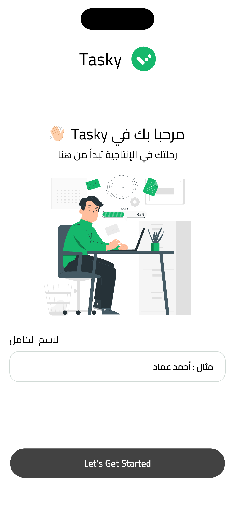 | 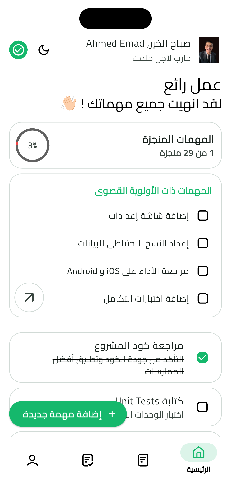 | 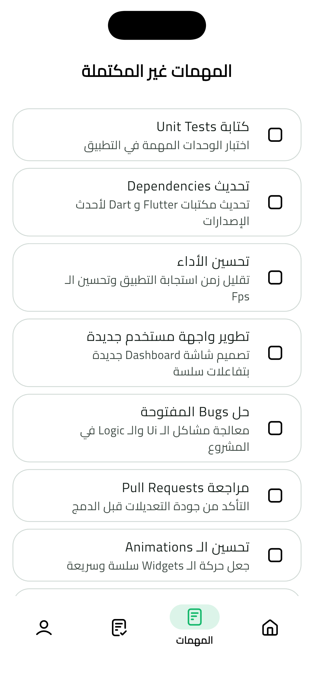 | 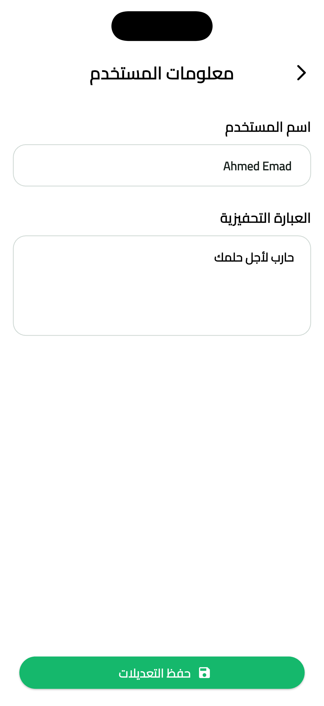 |

| Completed Tasks | Task Completed Dialog | All Tasks Completed |
|-----------------|----------------------|-------------------|
| 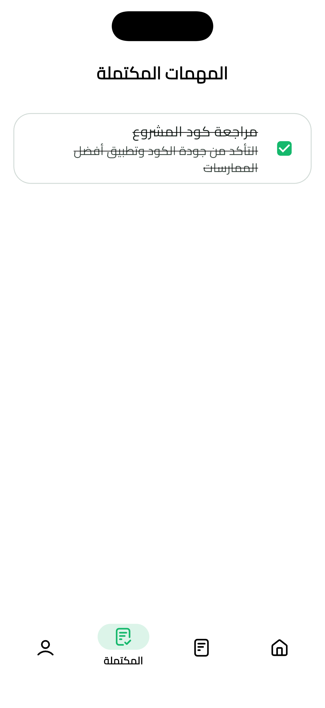 | 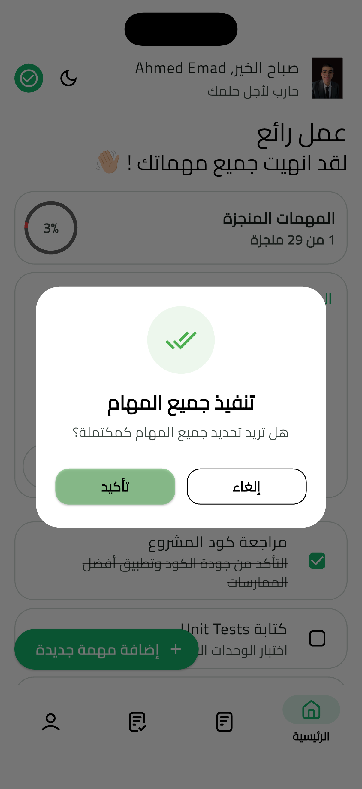 | 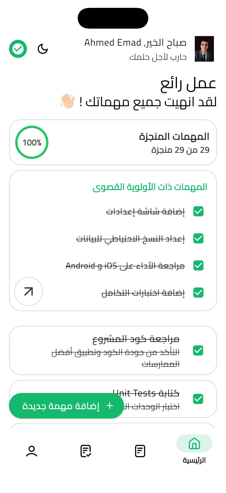 |

### Dark Mode 🌙

| Home Dark | Completed Tasks | Todo Tasks |
|-----------|-----------------|-----------|
| 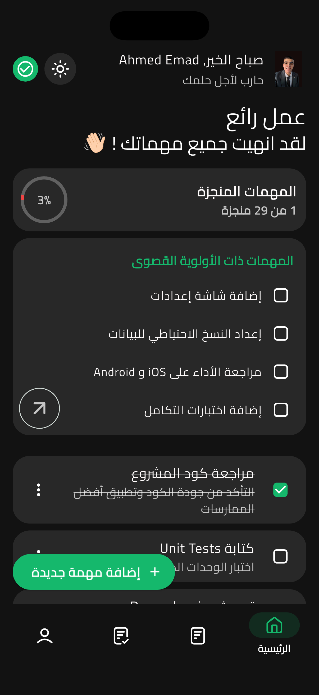 | 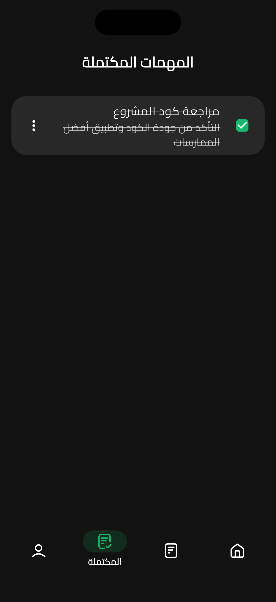 | 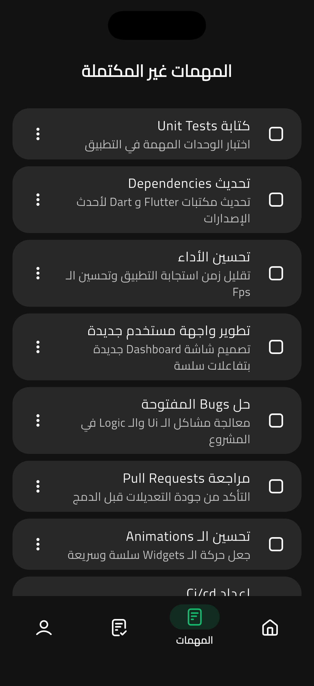 |

| Profile Dark |
|--------------|
| 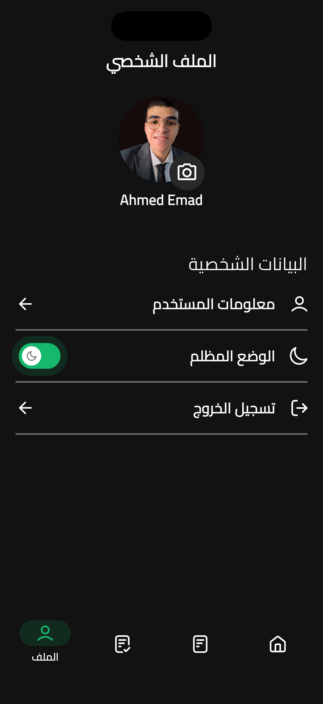 |

### Profile & Splash

| Profile Light | Splash Screen |
|---------------|---------------|
| 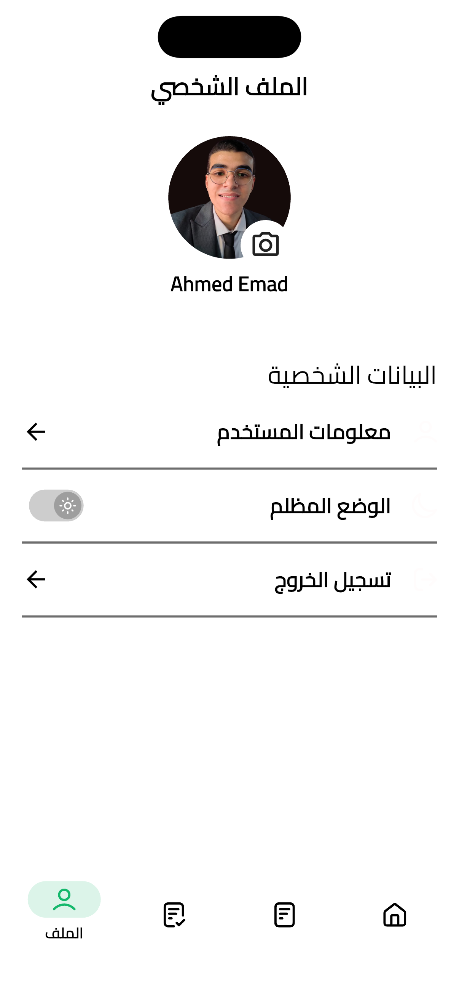 | 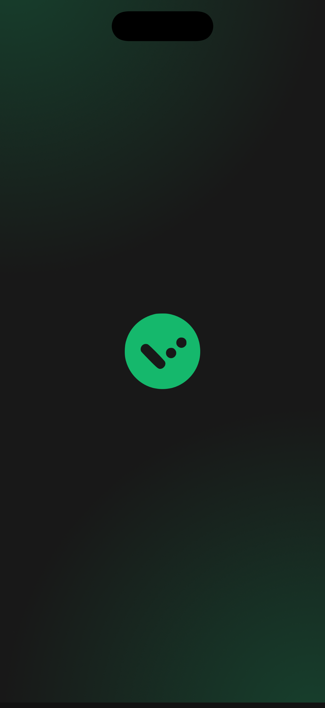 |

---

## 📁 Project Structure

```
lib/
├── main.dart                 # Application entry point
├── core/                     # Core functionality
│   ├── assets_manager/       # Asset management
│   ├── datasource/           # Data sources (API, local DB)
│   ├── extensions/           # Dart extensions
│   ├── router/               # Navigation & routing
│   ├── shared/               # Shared utilities
│   ├── theme/                # Theme configuration
│   └── utils/                # Helper utilities
└── Features/                 # Feature modules
    ├── home/                 # Home screen
    ├── main/                 # Main app module
    ├── profile/              # User profile
    ├── splash/               # Splash screen
    └── welcome/              # Welcome/onboarding
```

## 🛠️ Tech Stack

| Technology | Version | Purpose |
|-----------|---------|---------|
| Flutter | 3.10+ | UI Framework |
| Dart | 3.0+ | Programming Language |
| Provider | 6.1.5+ | State Management |
| Shared Preferences | 2.5.4 | Local Storage |
| Google Fonts | 8.0.2 | Typography |
| Flutter SVG | 2.2.3 | Vector Graphics |

---

## 🚀 Quick Start

### Prerequisites

- **Flutter SDK** 3.10.7 or higher
- **Dart SDK** 3.0+
- **Android Studio** (for Android development)
- **Xcode** (for iOS development)
- **CocoaPods** (for iOS dependencies)

### Installation Steps

1. **Clone the repository**
   ```bash
   git clone https://github.com/ahmedalaayq/Todo-App
   cd todo_app
   ```

2. **Install dependencies**
   ```bash
   flutter pub get
   ```

3. **Generate localization files**
   ```bash
   flutter gen-l10n
   ```

4. **Run the application**
   ```bash
   # For iOS
   flutter run -d ios
   
   # For Android
   flutter run -d android
   
   # For Web
   flutter run -d web
   ```

---

## 📦 Key Dependencies

- **provider** (6.1.5+) - State management
- **flutter_localizations** - Multi-language support
- **fluttertoast** - Toast notifications
- **shared_preferences** - Local data persistence
- **google_fonts** - Typography
- **flutter_svg** - Vector graphics
- **animated_snack_bar** & **top_snackbar_flutter** - Enhanced notifications

## 🌐 Localization & Themes

### 🌍 Multi-Language Support

The app provides seamless localization for:
- **English** - `lib/l10n/intl_en.arb`
- **Arabic** - `lib/l10n/intl_ar.arb`

Generated files are in `lib/generated/l10n.dart`

### 🎨 Theme System

Complete dark and light theme support with:
- Dynamic theme switching
- Consistent color palettes
- Responsive typography
- Custom widget styling

Theme configuration is managed in `lib/core/theme/`

## 🏗️ Architecture & Code Organization

This project follows **Clean Architecture** principles:

```
lib/
├── main.dart                    # Entry point
├── core/                        # Business logic & configuration
│   ├── assets_manager/          # Image & asset management
│   ├── datasource/              # Local & remote data sources
│   ├── extensions/              # Dart language extensions
│   ├── router/                  # Navigation setup
│   ├── shared/                  # Shared widgets & utilities
│   ├── theme/                   # Theme & styling
│   └── utils/                   # Helper utilities
└── Features/                    # Feature-specific modules
    ├── home/                    # Home/task list screen
    ├── main/                    # Main app structure
    ├── profile/                 # User profile management
    ├── splash/                  # Splash screen
    └── welcome/                 # Welcome/onboarding flow
```

**Key Benefits:**
- 🔒 Separation of concerns
- 🧪 Easy to test
- 🔄 Reusable components
- 📈 Scalable structure

## 📱 Platform Support

| Platform | Status | Notes |
|----------|--------|-------|
| **iOS** | ✅ Full Support | Minimum iOS 12.0 |
| **Android** | ✅ Full Support | Minimum Android 5.0 (API 21) |
| **Web** | ✅ Full Support | Chrome, Firefox, Safari |

### Platform-Specific Configuration

- **Android** - Gradle-based build system with native plugin support
- **iOS** - CocoaPods for dependency management
- **Web** - Progressive Web App (PWA) ready

---

## 🔨 Build & Deployment

### Development Build

```bash
# Debug build for testing
flutter run
```

### Production Build

**Android:**
```bash
# APK Release
flutter build apk --release

# App Bundle (for Google Play)
flutter build appbundle --release
```

**iOS:**
```bash
# iOS App
flutter build ios --release

# Build archive for App Store
flutter build ios --release --verbose
```

**Web:**
```bash
flutter build web --release
```

---

## 🎯 Features in Detail

### Task Management
- Create unlimited tasks
- Edit task details
- Mark tasks as complete
- Delete tasks with confirmation
- Organize with categories (future)

### User Experience
- Smooth animations and transitions
- Responsive layout for all screen sizes
- Fast performance optimization
- Intuitive navigation

### Data Persistence
- Local storage with Shared Preferences
- Automatic data synchronization
- No internet required

---

## 🤝 Contributing

We welcome contributions! Here's how you can help:

1. **Fork** the repository
2. **Create** a feature branch (`git checkout -b feature/AmazingFeature`)
3. **Commit** your changes (`git commit -m 'Add some AmazingFeature'`)
4. **Push** to the branch (`git push origin feature/AmazingFeature`)
5. **Open** a Pull Request

### Development Guidelines

- Follow Dart style guide
- Write clean, readable code
- Add comments for complex logic
- Test your changes thoroughly

---

## 📝 License

This project is licensed under the MIT License - see the [LICENSE](LICENSE) file for details.

---

## 🙏 Acknowledgments

- Flutter & Dart teams for amazing frameworks
- Community for incredible packages
- Designers for beautiful UI/UX inspiration

---

## 📚 Resources & Documentation

**Official Resources:**
- [Flutter Documentation](https://docs.flutter.dev/)
- [Dart Language Guide](https://dart.dev/guides)
- [Flutter Cookbook](https://docs.flutter.dev/cookbook)

**Learning Resources:**
- [Flutter YouTube Channel](https://www.youtube.com/c/flutterdev)
- [Dart Pad Playground](https://dartpad.dev)
- [Pub.dev Packages](https://pub.dev)

**Community:**
- [Flutter Community](https://flutter-community.dev)
- [Stack Overflow - Flutter Tag](https://stackoverflow.com/questions/tagged/flutter)

---

## 💡 Troubleshooting

### Common Issues

**Issue: Build fails on first run**
```bash
flutter clean
flutter pub get
flutter run
```

**Issue: iOS build fails**
```bash
cd ios
pod install --repo-update
cd ..
flutter run
```

**Issue: Localization not working**
```bash
flutter pub get
flutter gen-l10n
flutter run
```

---

## 👨‍💻 Author

Created by Ahmed Alaayq ❤️ 

---

<div align="center">

**[⬆ back to top](#-todo-app)**

Made by Flutter 🚀

</div>
